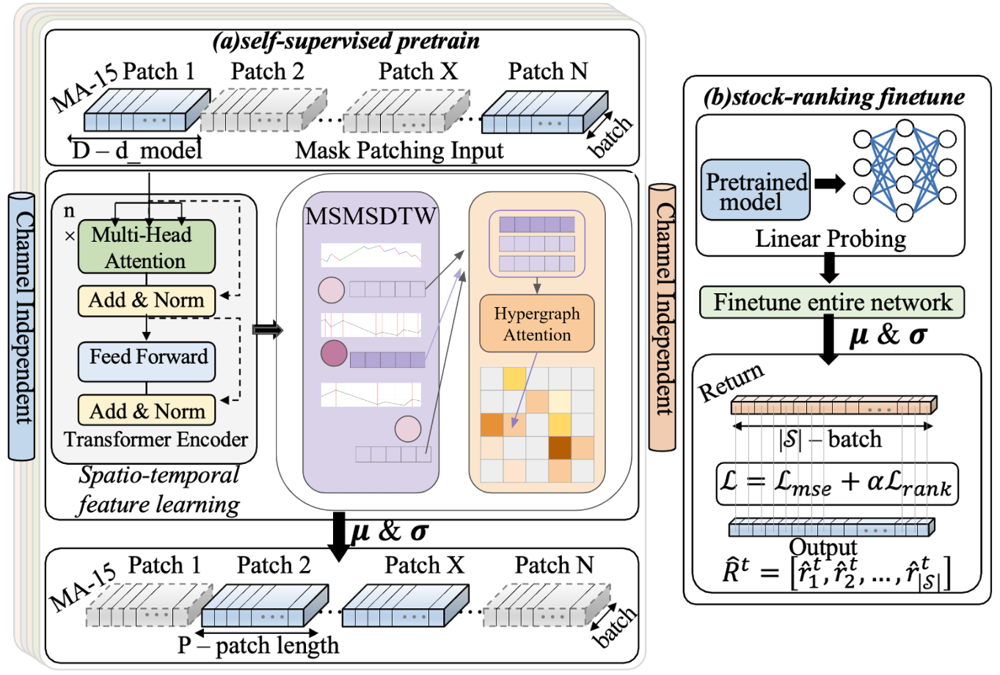

# MSMS-CI-STHPAN
---

## 🧠 Model Overview

<p align="center">
  
</p>

- **CI-STHPAN** serves as the base architecture for time-series and graph relational modeling.
- **MSMS-DTW** handles market-aware segmentation and similarity measurement.
- The constructed **hypergraph** captures multi-stock relations with higher-order dynamics.

Quantitative stock selection remains a complex challenge due to the multi-structural and non-stationary nature of financial markets. To address this, we propose MSMS-DTW (Market-Segmented Multi-Scale Dynamic Time Warping), a similarity-fusion method that enhances temporal alignment and interpretability.

MSMS-DTW segments the market timeline using the turning points of a benchmark stock and restricts DTW computation to stocks within the same segment, thus preserving phase-specific dynamics.

By incorporating multi-scale segmentation and DTW normalization, our method captures localized synchronization patterns and mitigates the temporal-distortion issues present in global DTW. We further integrate MSMS-DTW into the CI-STHPAN (Channel-Independent Spatio-Temporal Hypergraph Pretrained Attention Network) framework, leveraging channel-wise independence and hypergraph structures for robust stock-relation modeling.

## 📦 Installation

```bash
# 1. Create and activate conda env
conda create -n MSMSDTW python=3.10.12
conda activate MSMSDTW

# 2. Install PyTorch (CUDA 11.8)
conda install pytorch torchvision torchaudio pytorch-cuda=11.8 -c pytorch -c nvidia

# 4. Other Python packages
pip install -r requirements.txt
```

---

## Implementation Steps

```bash
# Step 1: Construct MSMSDTW Similarity
# (Use our core method to compute multi-scale DTW-based stock similarity)

python MSMSDTW.py

# Step 2: Generate Top-K Adjacency Binary Matrix
# (Transform similarity matrices into binary adjacency matrices 
#  by selecting the top-K most similar stocks per feature)

python generate_topk_adjacency.py

```
## Quick Example (Using Preprocessed In NAS)
If you have already computed the MSMSDTW similarity matrices and binary adjacency matrices, you can directly copy the preprocessed dataset from NAS and start training and finetuning:
```bash
# Step 1: Copy preprocessed dataset from NAS
 /NAS/DATA/M11215104/datasets.zip 
 Please unzip to this folder :  CI-STHPAN_self_supervised/src/data


# Step 2: Pre-train the model
cd CI-STHPAN_self_supervised
bash scripts/pretrain/pre_graph_MSMSDTW-min.sh

# Step 3: Fine-tune the model
bash scripts/finetune/[31]graph_MSMSDTW-min.sh
```


## 📊 Experimental Results

| Dataset | Model                 | IRR     | Sharpe Ratio |
|---------|------------------------|---------|---------------|
| NASDAQ | CI-STHPAN (baseline)  | 0.67712 | 1.32892       |
| NASDAQ | MSMS-CI-STHPAN (ours) | **0.92297** | **2.20432**       |
| NYSE   | CI-STHPAN (baseline)  | 0.61387 | 1.15443       |
| NYSE   | MSMS-CI-STHPAN (ours) | **0.83225** | **1.90761**       |

> 🔬 Metrics include Internal Rate of Return (IRR) and Sharpe Ratio (SR). Experiments are conducted under fixed seeds and repeated runs.
---

For any questions, please contact `Adam6833@gmail.com.com`. Contributions and pull requests are welcome!
